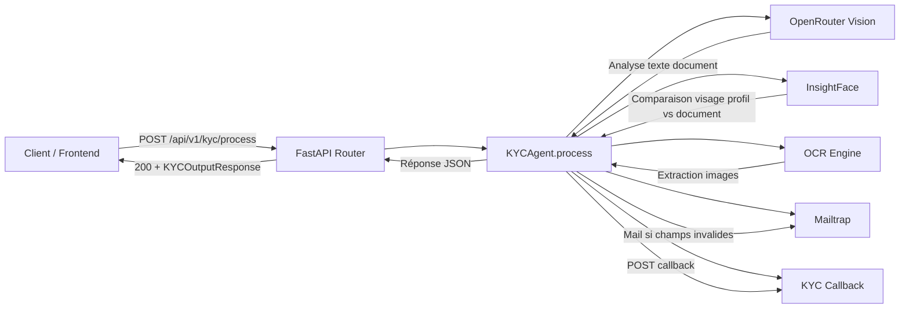

# KYC Validation Pipeline

## Schéma du pipeline



### Flux de traitement

1. **Réception** : La route `POST /api/v1/kyc/process` reçoit un formulaire `multipart/form-data` contenant les champs textuels et les fichiers images.
2. **Extraction images** : Les octets des fichiers sont extraits via `ocr_engine`.
3. **Analyse document (OpenRouter Vision)** : Les images du document (CNI recto/verso ou passeport) sont envoyées au modèle `meta-llama/llama-4-scout` qui vérifie la cohérence des champs textuels déclarés.
4. **Reconnaissance faciale (InsightFace)** : Le `photo_profile` est comparé à la photo du document via `buffalo_l` + cosine similarity. Si les visages ne correspondent pas, `photo_profile` est marqué `invalid`.
5. **Validation locale** : Les champs `date_naissance`, `date_expiration`, `sexe`, `num_CNI_passeport` et `nom_et_prenom` sont validés localement (format, bornes, valeurs autorisées).
6. **Calcul du score** : `total_percentage` commence à 100. Chaque champ invalide dans les champs à pénalité retire sa pénalité. `state_status` est `valide` uniquement si `total_percentage >= 60`.
7. **Notification email** : Si des champs sont invalides, un email de type `warning` est envoyé via Mailtrap avec les raisons d'invalidité.
8. **Callback HTTP** : Un `POST` est envoyé à `KYC_CALLBACK_URL` avec le score et la raison du rejet.
9. **Réponse** : Retour d'un objet `KYCOutputResponse` avec le statut par champ, le score global et la description des champs invalides.

---

## Stack technique

| Composant | Technologie | Rôle |
|-----------|-------------|------|
| **API** | FastAPI + Uvicorn | Route principale, validation Pydantic |
| **IA / Vision** | OpenRouter API (`meta-llama/llama-4-scout`) | Analyse OCR et validation des champs textuels |
| **Reconnaissance faciale** | InsightFace (`buffalo_l`, ONNX Runtime) | Comparaison `photo_profile` vs photo document |
| **Email** | Mailtrap (SMTP) | Notification des champs invalides |
| **Callback** | httpx | Notification du service appelant |
| **Images** | Pillow + OpenCV | Traitement et décodage des images |
| **Conteneurisation** | Docker + Docker Compose | Build et run de l'API |
| **Tests** | pytest + pytest-asyncio | Tests unitaires et d'intégration |

### Modèles et seuils

- **OpenRouter Vision** : `meta-llama/llama-4-scout`, `temperature=0.0`
- **InsightFace** : modèle `buffalo_l`, seuil de similarité cosinus >= `0.40` par défaut
- **Score global** : commence à 100, pénalités par champ invalide, seuil de validité à 60
- **Tesseract** : non utilisé dans le pipeline final (seul OpenRouter Vision valide les textes)

---

## Prérequis

- Python 3.12+
- Docker & Docker Compose
- Clé API OpenRouter (`OPENROUTER_API_KEY`)
- Compte Mailtrap (SMTP)
- (Optionnel) GPU NVIDIA pour InsightFace sinon CPU

---

## Lancer le projet en local

### 1. Cloner le repo

```bash
git clone <repo-url>
cd kyc-validation-pipeline
```

### 2. Créer un environnement virtuel

```bash
python3 -m venv .venv
source .venv/bin/activate
```

### 3. Installer les dépendances

```bash
pip install -r requirements.txt
```

### 4. Configurer les variables d'environnement

Copier `.env.example` en `.env` et remplir les valeurs :

```bash
cp .env.example .env
```

Variables obligatoires :

```env
OPENROUTER_API_KEY=...
SMTP_HOST=sandbox.smtp.mailtrap.io
SMTP_PORT=2525
SMTP_USER=...
SMTP_PASSWORD=...
EMAIL_FROM=...
KYC_CALLBACK_URL=...
KYC_CALLBACK_TOKEN=...
```

Variables optionnelles InsightFace :

```env
INSIGHTFACE_MODEL=buffalo_l
INSIGHTFACE_PROVIDERS=CPUExecutionProvider
INSIGHTFACE_THRESHOLD=0.40
INSIGHTFACE_CTX_ID=-1
```

### 5. Lancer l'API

```bash
uvicorn app.main:app --host 0.0.0.0 --port 8000 --reload
```

L'API est accessible sur `http://localhost:8000`.

### 6. Tester la santé

```bash
curl http://localhost:8000/health
```

### 7. Lancer les tests

Lancer tous les tests :

```bash
pytest tests/ -v
```

Lancer un fichier de tests spécifique :

```bash
pytest tests/test_agent.py -v
pytest tests/test_api.py -v
pytest tests/test_validation.py -v
```

Lancer les tests avec couverture :

```bash
pytest tests/ -v --cov=app --cov-report=term-missing
```

---

## Lancer avec Docker

### 1. Build de l'image

```bash
docker compose build
```

### 2. Démarrer le service

```bash
docker compose up -d
```

### 3. Vérifier le statut

```bash
docker compose ps
docker logs kyc-validation-api
```

### 4. Tester

```bash
curl http://localhost:8000/health
```

### 5. Arrêter le service

```bash
docker compose down
```

### Notes

- Le premier lancement télécharge les modèles InsightFace (~280 MB) dans `.insightface/`.
- Le répertoire `.insightface/` est exclu de git via `.gitignore`.
- Le port exposé est `8000`.

---

## Documentation API

Voir `docs/integration.md` pour le détail de l'endpoint `/api/v1/kyc/process` (requête, réponse, codes d'erreur, exemples).
